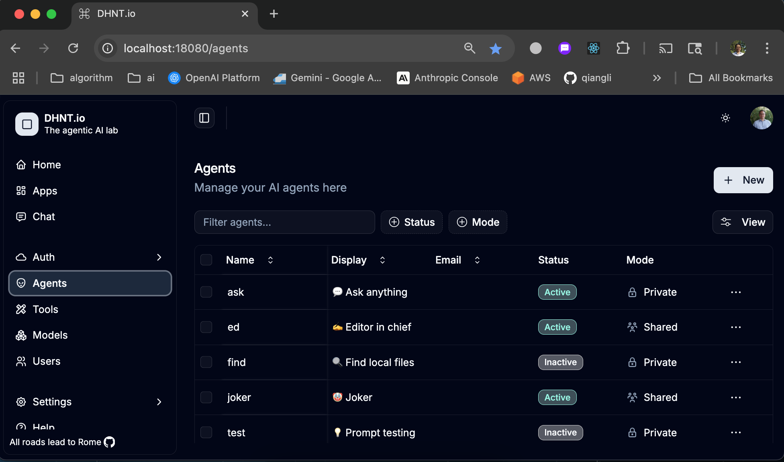

# dhnt.io
DHNT.io Cloud AI feature request and issue tracker

## Cloud AI Hub

The site will be live soon... Here is a preview:

### Auth


### Admin



### Share


### Chat


## How to ...

### Create Agent

[YAML](https://yaml.org/) is used for setting up agents, tools, and models. See examples [here](examples/)

```yaml
###
agents:
  - name: "ed"
    display: "✍️ Editor"
    description: "An expert in editing and proofreading."
    model: L1
    instruction:
      content: |
        You are tasked with editing and proofreading text. Focus on ensuring style consistency,
        accuracy in fact-checking, and clarity. Correct any mistakes or inconsistencies in spelling,
        punctuation, and word usage.
        Provide the final corrected version only in your response.
###
```

### Share

You may optionally share your agent with your family and friends.

### Use

Start your input with the agent name you created: @[agent]

```text
@ed [your input here]

```
